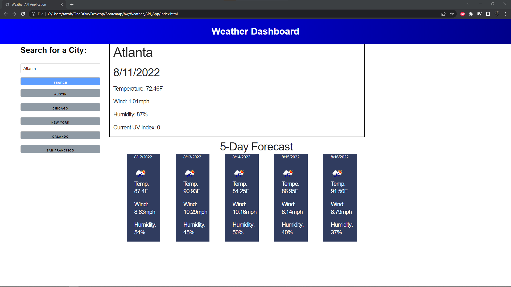

# Weather API Application

## User Story
```
AS A traveler
I WANT to see the weather outlook for multiple cities
SO THAT I can plan a trip accordingly
```

## Description of application

This application uses the free API service from https://openweathermap.org/ to fetch weather data. The user is presented with a search bar that allows them to search any city in the United States. When they hit search they are presented with the current days weather as well as the next five days.

## Screenshot showcasing application



## Deployed link to application via GitHub
https://minotaurius.github.io/Weather_API_App/

## Link to repo storing application
https://github.com/Minotaurius/Weather_API_App
